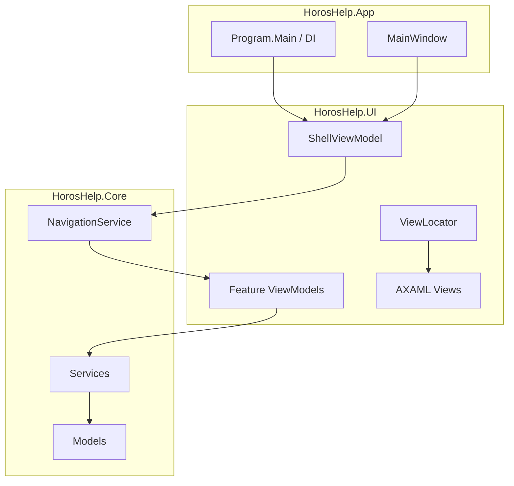

# HorosHelper — Architektur

Technische Referenz für die HorosCode-Desktop-App **HorosHelper**: Windows-Systemwartung mit Avalonia UI, MVVM und DI.

## Überblick

| Eigenschaft | Wert |
|-------------|------|
| Plattform | **Windows only** (Win32-APIs, WMI, `PerformanceCounter`) |
| Runtime | **.NET 9** |
| UI | **Avalonia 12** (Fluent, Compiled Bindings) |
| Muster | MVVM, Constructor Injection (`Microsoft.Extensions.DependencyInjection`) |
| Solution | `HorosHelp.sln` — `src/`, `tests/`, `assets/` |

Die App startet **ohne** `requireAdministrator` im Manifest. Admin-Rechte werden nur bei Bedarf angefordert (siehe [UAC-Strategie](#uac-strategie)).

## Schichtenmodell

```text
HorosHelp.App          → Einstieg, DI-Container, MainWindow, App-Lifetime
        │
        ├── HorosHelp.Core   → Domänenlogik, Services, Models, Navigation
        │
        └── HorosHelp.UI     → Views, ViewModels, Styles, ViewLocator
```

### HorosHelp.App

- `Program.Main`: `ServiceCollection` aufbauen → `AddHorosHelpCore()` + `AddHorosHelpUi()` → `BuildServiceProvider()` → Avalonia starten
- `App.OnFrameworkInitializationCompleted`: `ShellViewModel` aus DI, `MainWindow` binden
- Keine Geschäftslogik — nur Bootstrap und Fenster-Hosting

### HorosHelp.Core

- **Navigation:** `INavigationService`, `NavigationService`, `NavigationRoutes`
- **Services:** z. B. `ISystemHealthService` / `SystemHealthService`
- **Models:** z. B. `SystemHealthSnapshot`
- **Interop:** Windows-native Hilfen (`NativeMemoryStatus`, WMI)
- Plattformunabhängige Schnittstellen; Windows-Implementierungen hinter `OperatingSystem.IsWindows()`-Guards

### HorosHelp.UI

- **ViewModels:** `ViewModelBase` (CommunityToolkit.Mvvm), Feature-VMs unter `ViewModels/Features/`, Shell unter `ViewModels/Shell/`
- **Views:** AXAML unter `Views/Features/` und `Views/Shell/`
- **ViewLocator:** Konvention `FooViewModel` → `FooView` (Reflection-Mapping)
- **Styles:** `DesignTokens.axaml`, `Components.axaml`
- ViewModels binden **nur** an Core-Services — keine direkten Win32-Aufrufe in der UI-Schicht



## Navigation

`NavigationService` hält `CurrentRoute` und `CurrentViewModel`. `NavigateTo(route)` löst per injiziertem Resolver das passende ViewModel auf und feuert `Navigated`.

Registrierung in `HorosHelp.UI.DependencyInjection.ServiceCollectionExtensions`: Route-String → Singleton-ViewModel.

### Routen (11)

| Konstante | Route-ID | ViewModel |
|-----------|----------|-----------|
| `Dashboard` | `dashboard` | `DashboardViewModel` |
| `ProblemFixer` | `problem-fixer` | `ProblemFixerViewModel` |
| `Wissen` | `wissen` | `WissenViewModel` |
| `Speicher` | `speicher` | `SpeicherViewModel` |
| `Startup` | `startup` | `StartupViewModel` |
| `Netzwerk` | `netzwerk` | `NetzwerkViewModel` |
| `Sicherheit` | `sicherheit` | `SicherheitViewModel` |
| `Apps` | `apps` | `AppsViewModel` |
| `Backup` | `backup` | `BackupViewModel` |
| `Copilot` | `copilot` | `CopilotViewModel` |
| `Einstellungen` | `einstellungen` | `EinstellungenViewModel` |

Start-Route: `dashboard` (`ShellViewModel`-Konstruktor). Sidebar synchronisiert aktiven Eintrag über `Navigated`.

## SystemHealthService (Feature 1)

**Zweck:** Echtzeit-Systemzustand für das Dashboard — CPU, RAM, Festplatte, Netzwerk — als einheitlicher Snapshot mit Score und Warnungen.

### Schnittstelle

```csharp
public interface ISystemHealthService : IDisposable
{
    SystemHealthSnapshot GetSnapshot();
}
```

Registrierung: `AddHorosHelpCore()` → Singleton `ISystemHealthService` / `SystemHealthService`.

### Datenquellen (Windows)

| Metrik | Quelle | Fallback |
|--------|--------|----------|
| CPU | `PerformanceCounter` (`% Processor Time`), sonst WMI `Win32_Processor` | Mock-Wert |
| RAM | `GlobalMemoryStatusEx` via `NativeMemoryStatus` | Mock-Wert |
| Festplatte | `DriveInfo` (Systemlaufwerk) | Mock-Wert |
| Netzwerk | `NetworkInterface.GetIsNetworkAvailable()` + aktive Nicht-Loopback-Interfaces | `NetworkOk = false` |

Bei Teilausfall oder Nicht-Windows: Fallback-/Mock-Snapshot mit `IsMockData = true`; Logging über `ILogger`.

### Auswertung

- **`SystemHealthAnalyzer`:** berechnet `HealthScore` (0–100) und `Warnings` anhand `SystemHealthThresholds` (CPU/RAM/Disk Warning 80/90 %, Disk Warning 85 %)
- **`SystemHealthSnapshot`:** KPI-Werte, `HealthScore`, `Warnings[]`, `IsMockData`

### UI-Anbindung

`DashboardViewModel` pollt `GetSnapshot()` alle **2 s** (`Dispatcher.UIThread`), füllt KPI-Karten (`ProgressRing`, `Sparkline`) und Warnliste. Keine Windows-API in der UI — ausschließlich `ISystemHealthService`.

## UAC-Strategie

**Entscheidung: Elevation on demand** (nicht permanenter Admin-Start).

| Aspekt | Vorgehen |
|--------|----------|
| Standard | App läuft mit Benutzerrechten (`asInvoker`) |
| Admin-Aktionen | UAC-Dialog erst beim Klick auf geschützte Aktion (Registry-Schreiben, Dienststeuerung, Treiber, …) |
| UI | UAC-Shield auf betroffenen Buttons; `ShellViewModel.ShowAdminBadge` zeigt Elevated-Status |
| Implementierung | Elevated Helper-Prozess oder `runas`/`ShellExecute` mit `Verb = "runas"` — isoliert von der Haupt-UI |
| Prinzip | Least Privilege: Core-Services prüfen Berechtigung vor Ausführung |

Permanenter Admin-Start (`requireAdministrator` im Manifest) ist **nicht** vorgesehen — größere Angriffsfläche, unnötig für reine Lese-Features wie Feature 1.

## Design-Tokens (Slate + Amber)

Zentrale Definition: `src/HorosHelp.UI/Styles/DesignTokens.axaml` (Mockup-01).

| Token | Wert | Verwendung |
|-------|------|------------|
| `ColorBackgroundBase` | `#0F172A` | App-Hintergrund (Slate 900) |
| `ColorSurfaceElevated` / `ColorSurfaceSidebar` | `#1E293B` | Karten, Sidebar (Slate 800) |
| `ColorAccentPrimary` | `#F59E0B` | Aktive Navigation, Fokus (Amber 500) |
| `ColorTextPrimary` | `#F8FAFC` | Primärtext |
| `ColorTextSecondary` / `ColorTextMuted` | `#94A3B8` / `#64748B` | Sekundärtext |
| `ColorBorder` / `ColorBorderFocus` | `#334155` / `#F59E0B` | Rahmen, Fokusring |
| `ColorStatusOk` | `#22C55E` | Gesundheits-OK |

Layout-Konstanten: `SidebarWidth` **199** (Mockup-01), `TitleBarHeight` 46, `StatusBarHeight` 36, `NavItemHeight` 40. Spacing `Spacing1`–`Spacing6` (4–24 px), Radius `RadiusSm`/`Md`/`Lg`.

Komponenten-Styles in `Components.axaml`: `nav-item`, `horos-card`, `horos-primary`, `status-badge`, `section-header` — referenzieren Design-Tokens.

## Feature 10 — Copilot

**Services:** `ICopilotService`, `ILlmProvider`, `ILlmProviderFactory`, `ICopilotToolExecutor`

| Modus | Verhalten |
|-------|-----------|
| Offline (Default) | `RuleBasedCopilotProvider` — `CopilotRuleEngine`, kein Netzwerk |
| OpenAI-kompatibel | `HttpLlmProvider` → `/v1/chat/completions`, SSE-Streaming |
| Ollama | `HttpLlmProvider` → `/api/chat`, NDJSON-Streaming |

**Secrets:** `ISecureSecretStore` / `DpapiSecretStore` — API-Key nie in `settings.json`.

**Diagnose:** `CopilotDiagnosticWizard` stellt Rückfragen; bei Zustimmung `RunProblemScan` / `RunNetworkPing`.

**UI:** `CopilotViewModel` streamt Tokens; Einstellungen → Copilot-Kategorie.

## Lokalisierung

- Ressourcen: `HorosHelp.UI/Resources/Strings.resx` (Default DE), `Strings.de-DE.resx`, `Strings.en.resx`
- `UiStrings` + `Program.ApplyStartupCulture()` — `de-DE` Standard, Englisch für Nav-Labels
- **MVP:** Restliche UI-Texte bewusst hardcoded auf Deutsch; schrittweise Auslagerung möglich

## Abhängigkeitsrichtung

```text
App → UI → Core
```

`HorosHelp.Core` kennt weder Avalonia noch ViewModels. Neue Features: Service/Model in Core, ViewModel + View in UI, Registrierung in beiden `ServiceCollectionExtensions`, Route in `NavigationRoutes` + Resolver-Switch.

## Tech-Stack-Entscheidung

| Option | Status | Begründung |
|--------|--------|------------|
| **A: C# / Avalonia** | **Gewählt** | HorosCode Desktop-Konsistenz, plattformfähig, Fluent Dark Theme |
| B: C# / WPF | Verworfen | Nur Windows, kein HorosCode-Stack-Alignment |
| C: C# / MAUI | Verworfen | Höhere Komplexität für Desktop-First |

## Feature 9 — Backup & Wiederherstellung

**Services:** `IBackupService`, `IRestorePointService`, `IBackupSchedulerService`, `IBackupEncryptionService`

| Funktion | Implementierung |
|----------|-----------------|
| Inkrementelles Backup | SHA-256-Hashes in `manifest.json`; nur geänderte Dateien kopieren |
| AES-256-Verschlüsselung | `BackupEncryptionService` — AES-256-CBC, Master-Key via **Windows DPAPI** (`%AppData%\HorosHelper\backup-master-key.dpapi`) |
| Wiederherstellungspunkte | **Primär:** `SRSetRestorePoint` P/Invoke (`srclient.dll`) · **Fallback:** `Checkpoint-Computer` PowerShell |
| Zeitplanung | `schtasks`-Wrapper (`SchTasksSchedulerClient`); Headless-Modus `--backup-run <profileId>` in `Program.cs` |
| Input-Validierung | `InputSecurityValidator` vor `Process.Start` / PowerShell / Pfad-Operationen |

**Profile:** JSON in `%AppData%\HorosHelper\backup-profiles.json` — enthält `Schedule`, `EncryptBackups`, Quell-/Zielordner.

**Tests:** `BackupServiceTests` (Mock-Filesystem), `RestorePointServiceTests` (Mock-PowerShell), `BackupSchedulerServiceTests`, `InputSecurityValidatorTests`.
